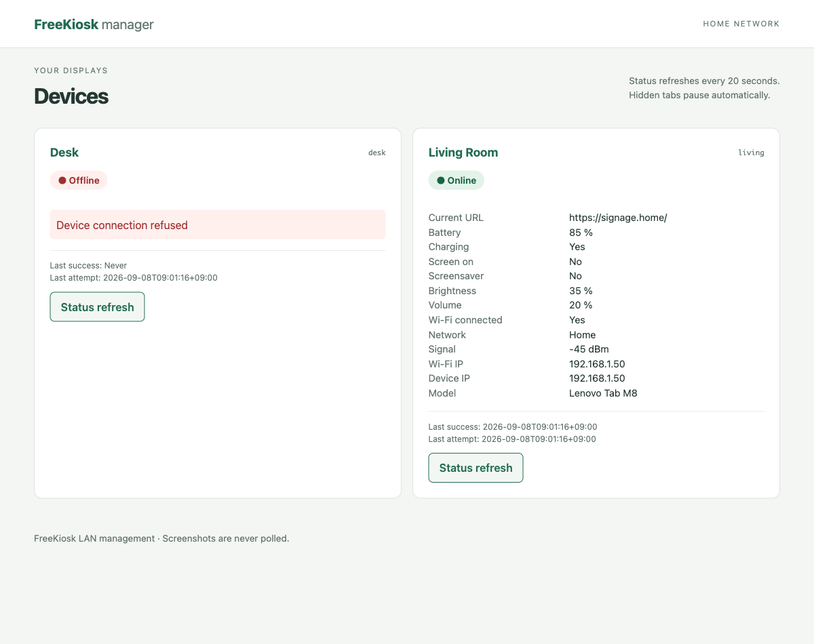

# FreeKiosk manager

[English](README.md)

家庭内LANのFreeKioskタブレットを管理するGo製CLI + Web UIです。DBなし、設定ファイルのみで複数端末を管理します。CLIはCobra（shell completion付き）、エラー処理は`k1LoW/errors`、画面はBarefootJSのTSXからGo `html/template`へコンパイルします。



## ビルド・起動

Nixのflakesを有効にした環境で:

```sh
nix build
./result/bin/freekioskctl --help
./result/bin/freekioskd -config /path/to/freekiosk.json -listen 0.0.0.0:8080
```

`result/bin/`に`freekioskctl`と`freekioskd`が生成されます。Web用JS・CSS・テンプレートはembed済みです。実行時はそれぞれのバイナリと設定だけで動き、Node.jsは不要です。初期listenは`127.0.0.1:8080`です。LANから使う場合に上記のように変更してください。

NixなしではGo 1.27.1とNode.js 24.12以降を用意して:

```sh
npm ci
npm run build
go build -o bin/freekioskctl ./cmd/freekioskctl
go build -o bin/freekioskd ./cmd/freekioskd
```

生成物はリポジトリに含めます。Goだけの変更であれば`go build ./...`を直接実行できます。TSX/TypeScript/CSSを変更した場合は先に`npm run build`してください。

## 設定

`config.example.json`を参考に`freekiosk.json`を作成してください。TOMLパーサーの追加を避け、Go標準の`encoding/json`で厳密に読めるJSONを採用しています。

```json
{
  "devices": {
    "living": {
      "name": "Living Room",
      "url": "http://192.168.1.50:8080",
      "api_key": "your-secret-key"
    },
    "desk": {
      "name": "Desk",
      "url": "http://192.168.1.51:8080",
      "api_key": "another-key"
    }
  }
}
```

設定ファイルは`chmod 600 freekiosk.json`などで保護してください。device IDは`[a-z][a-z0-9_]{0,63}`、URLはHTTP(S)のscheme・host・portのみです。`name`省略時はIDを表示します。API keyを未設定の端末では`api_key`を省略できます。

| 環境変数                   | 用途                               |
| -------------------------- | ---------------------------------- |
| `FREEKIOSK_CONFIG`         | 設定パス（初期値`freekiosk.json`） |
| `FREEKIOSK_LISTEN`         | Web listen address                 |
| `FREEKIOSK_API_KEY_living` | `living`のAPI key上書き            |
| `FREEKIOSK_URL_living`     | `living`の接続先上書き             |

接尾辞は設定中のIDをそのまま使います。フラグが環境変数より優先します。設定の変更後はサーバーを再起動してください。

## CLI

```sh
freekioskctl devices
freekioskctl status living
freekioskctl reload living
freekioskctl url living
freekioskctl url living https://signage.home/
freekioskctl screen living on
freekioskctl screen living off
freekioskctl brightness living 30
freekioskctl volume living 20
freekioskctl screenshot living screenshot.png
freekioskctl toast living 'hello'
freekioskctl tts living '夕食の時間です' ja
freekioskctl --config /path/to/config.json --timeout 10s status living
```

明るさ・音量は整数の0–100%。TTSの言語は省略できます。漢字のみの日本語が中国語と判定される場合は`ja`を指定してください。スクリーンショットは取得成功後に一時ファイルからrenameするため、通信失敗で既存ファイルを壊しません（成功時は指定ファイルを置き換えます）。失敗時はstderrと非ゼロ終了コードを返します。

### Shell completion

Cobraの標準completionを利用します。補完処理は設定を読むだけで、タブレットに通信しません。コマンド、フラグ、設定済みdevice ID、`screen`の`on/off`、スクリーンショットのファイル名を補完します。

```sh
# zsh（compinit設定後）
source <(freekioskctl completion zsh)

# bash
source <(freekioskctl completion bash)

# fish
freekioskctl completion fish | source

# PowerShell
freekioskctl completion powershell | Out-String | Invoke-Expression
```

Nixパッケージにはbash/zsh/fish用スクリプトを同梱し、NixOS moduleの有効化時はCLIもsystemPackagesに追加します。シェル側の補完機能は有効にしてください。通常と異なる設定ファイルを補完に使う場合は`FREEKIOSK_CONFIG`を設定するか`--config`を指定します。

## Web UI

```sh
nix develop
go run ./cmd/freekioskd -config ./freekiosk.json -listen 0.0.0.0:8080
```

`http://server:8080/`で端末一覧、カードから詳細画面に移動します。Reload、screen on/off、brightness、volume、URL、toast、TTS、手動スクリーンショット取得に対応します。

statusは表示中のページから20秒間隔で取得します。非表示タブは次のpollを休止し、同一ブラウザではpollを重複させません。サーバーも同一端末への同時pollと3秒以内の再取得をまとめます。端末ごとに処理するため、offline端末が一覧ページの描画や他端末を待たせません。最後に成功したstatus・取得時刻と、最新の取得エラー・試行時刻を区別します。キャッシュはメモリのみで、サーバー再起動時に消えます。

スクリーンショットはクリック時だけ取得します。前回の画像は再取得失敗時にも残し、撮影時刻を表示します。初期timeoutは8秒、`-timeout`で最大1分まで変更できます。

画面上部のEnglish / 日本語で表示言語を切り替えられます。初期値は英語で、選択はCookieに1年間保存します。翻訳はラベル・状態・操作結果・エラーに適用され、デバイス名やURLなどの実データ、CLIとJSON APIは翻訳しません。

## FreeKiosk側の設定

[公式REST APIドキュメント](https://github.com/RushB-fr/freekiosk/blob/main/docs/rest-api.md)に従って設定します。

1. Secret buttonを5回タップし、PINで設定を開く。
2. AdvancedでEnable REST APIを有効化する。
3. ポート（初期値8080）とAPI keyを設定して保存する。
4. 操作を許可する設定も有効にする。無効だと操作APIは403を返します。
5. タブレットのLAN IPを本アプリの設定に登録する。DHCP予約を推奨します。

Screen OFFはAndroidの権限に応じて挙動が変わります。Device Owner / Device Admin / AccessibilityServiceが使えない場合は明るさを0にするfallbackです。statusの`screen.on`は物理的な画面状態、`screensaverActive`は別の状態です。App Brightness Controlが無効の場合、明るさ設定APIは無視されます。

WebView以外のアプリを撮影する場合、FreeKiosk v1.2.20以降ではAndroid 11以降とAccessibilityServiceが必要です。Lock ModeではSecurityのAllow Remote Screenshotsも確認してください。撮影不可の場合は503となります。TTSはAndroid側に対象言語の音声データが必要です。

## 対応API

2026-09-08に公式[REST API仕様](https://github.com/RushB-fr/freekiosk/blob/main/docs/rest-api.md)と[KioskHttpServer.kt](https://github.com/RushB-fr/freekiosk/blob/main/android/app/src/main/java/com/freekiosk/api/KioskHttpServer.kt)、[HttpServerModule.kt](https://github.com/RushB-fr/freekiosk/blob/main/android/app/src/main/java/com/freekiosk/api/HttpServerModule.kt)を確認しています。認証は全リクエストの`X-Api-Key`ヘッダーです。

| 操作       | FreeKioskへのリクエスト       | body / response                                         |
| ---------- | ----------------------------- | ------------------------------------------------------- |
| Status     | `GET /api/status`             | `success`, `data`, `timestamp`のJSON envelope           |
| 現在URL    | `GET /api/status`             | `data.webview.currentUrl`（`GET /api/url`は使いません） |
| Reload     | `POST /api/reload`            | bodyなし                                                |
| Screen     | `POST /api/screen/on` / `off` | bodyなし                                                |
| Brightness | `POST /api/brightness`        | `{"value":30}`                                          |
| Volume     | `POST /api/volume`            | `{"value":20}`                                          |
| URL変更    | `POST /api/url`               | `{"url":"https://signage.home/"}`                       |
| Screenshot | `GET /api/screenshot`         | `image/png`バイナリ                                     |
| Toast      | `POST /api/toast`             | `{"text":"hello"}`                                      |
| TTS        | `POST /api/tts`               | `{"text":"夕食","language":"ja"}`（languageは任意）     |

操作結果はHTTP statusだけでなく`success`と`data.executed`も検証します。コマンド成功は端末側の受理・実行応答であり、WebViewのロード完了を意味しません。statusの未提供フィールドは表示しません。新しい未知フィールドは無視し、既知フィールドの型不正はinvalid responseに分類します。

BFFは`GET /api/devices`、`GET /api/devices/{id}/status`、`GET /api/devices/{id}/screenshot`、`POST /api/devices/{id}/{action}`を提供します。POSTはJSON必須で、screenだけは`{"state":"on"}`を受け取ります。他は上表のbodyです。statusのBFF応答は`status`（最後の成功データ）、`online`、`last_success`、`last_attempt`、任意の`error`です。device通信エラーでもこのsnapshotはHTTP 200で返し、POST/画像の上流エラーは502、入力不正は400、未知端末は404です。

エラーの`kind`は`timeout`、`connection_refused`、`network`、`authentication`（401）、`forbidden`（403）、`http`、`invalid_response`、`api`、`unknown_device`、`validation`、`canceled`です。Web/CLIで同じclientを使います。

## セキュリティ

信頼できる家庭内LAN専用です。管理画面にログイン機能はなく、アクセス可能な人は端末を操作できます。インターネットに公開せず、必要なLAN/VLANにのみlisten・firewallを設定してください。FreeKioskのHTTP通信は暗号化されません。

API keyはバックエンドだけで利用し、HTML・JS・device一覧には含めません。上流のエラーメッセージや通信エラー文字列は認証情報を含む可能性があるため、そのままログ・画面へ流しません。statusのURL等に別のサービスの秘密情報を含めないでください。

設定済みdevice以外への接続、任意パスのproxy、リダイレクト追従を禁止します。環境変数のHTTP proxyも使いません。URL変更はHTTP(S)のみ、入力のサイズ・数値範囲を検証し、JSONと画像の応答サイズにも上限を設けています。別originからの操作を拒否し、CSPで外部script・frame埋め込み等を禁止しています。任意JS実行、アプリ起動、reboot等はMVPで公開していません。

## NixOS module

ホスト側flakeのinputsに本リポジトリを追加し、moduleをimportします。

```nix
{
  imports = [ inputs.freekiosk-manager.nixosModules.default ];

  services.freekiosk-manager = {
    enable = true;
    listenAddress = "0.0.0.0";
    port = 8080;
    configFile = "/run/secrets/freekiosk.json";
    # 信頼できるLANだけで公開する場合に指定
    openFirewall = true;
  };
}
```

設定の中身をNix式に埋め込まず、sops-nix/agenix等でruntimeのファイルを配置してください。`configFile`は文字列の絶対パスで指定します。systemdの`LoadCredential`経由でDynamicUserへ渡すため、元ファイルはrootのみread可能でも動作します。サービスはread-only filesystemと最小限の権限で動作します。

## 開発

`nix develop`にGo 1.27.1、golangci-lint 2.13.2、TypeScript compiler、Node.js、oxfmt 0.67.0、oxlint 1.82.0、Viteが入ります。Go・golangci-lint・Oxcは2026-09-08時点の最新安定版です。再現可能にするためflake.lockとpackage-lock.jsonを固定し、更新時は公式releaseとGo対応を確認してください。

```sh
nix develop
npm ci

# TSX → Go templates/types + browser JS、型チェック
npm run build

# format
golangci-lint fmt
oxfmt .

# lint
golangci-lint run
oxlint . --deny-warnings
npm run lint

# test / build
go test ./...
go build ./...
nix build

# 全工程
bash scripts/check.sh
```

Goのfmtはgolangci-lint経由でgofmt/goimportsに統一します。コード生成時の`components.go`だけは`npm run build`内でgofmtして再現性を保ちます。lintは標準lintersにnoctx/bodyclose/nilerrを追加しています。エラー分類は`k1LoW/errors.As/Is`、clientの新規エラーには`WithStack`を使用します。スタックをWebへserializeしません。

### BarefootJS / TypeScript

画面の正本は`web/src/components/*.tsx`です。`Page`は一覧・詳細の構成、`Status`はstatus部分、`Controls`は操作フォーム・loading・結果・スクリーンショットを定義します。公式`@barefootjs/go-template/vite`を使い、TSXからテンプレート・Goの型・必要なclient JSを生成します。手書きのGoテンプレートは`web/templates/layout.gohtml`のdocument枠だけです。

BarefootJSを選んだ理由は、TSXで画面を定義しながらGo側でHTMLを返し、操作が必要な部分にだけsignalとイベント処理を持たせられるためです。SPA routerや大きなフロントエンドstoreはありません。`main.ts`はpollと、サーバーでrender/escapeしたStatus fragmentの差し替えだけを担当します。

公式案内は[barefootjs.dev](https://barefootjs.dev/)と[公式リポジトリ](https://github.com/piconic-ai/barefootjs)、[Go Template Adapter](https://github.com/piconic-ai/barefootjs/blob/main/docs/core/adapters/go-template-adapter.md)です。指定されたbarefootjs.comは確認時に名前解決できませんでした。

BarefootJS 0.35.1はalphaでAPI変更の可能性があるため、パッケージとGo runtimeのコミットを固定しています。compilerのpeer dependencyに合わせTypeScript 5.9.3・Vite 6.4.3を使用します。Go runtimeはnpmパッケージに含まれず、upstreamのモジュール宣言名とリポジトリ配置が異なるため、go.modの`replace`で公式monorepoのruntimeを指定しています。Reactは依存に含みません（tsconfigの`react-jsx`はTSXの型チェック方式の名前です）。

oxfmtは手書きTS/TSX/CSS/JSON/Markdownを整形します。oxlintはTS/TSXのlint、`tsc --noEmit`は型チェックを担当します。oxlintはHTML/CSSのlinterではありません。Goテンプレート構文を壊さないよう`web/templates/`と生成物はoxfmtから除外します。画面のHTMLに相当する部分は元のTSX側で整形します。

翻訳辞書は `web/locales/en.json` と `web/locales/ja.json` です。同じキーで翻訳を追加し、TSXでは `props.text` を参照します。辞書はGoとTypeScriptで共有し、追加のi18nライブラリは使用しません。変更後は `npm run build` してください。

生成先は`web/generated/`（テンプレート）、`web/views/components.go`（型）、`web/static/generated/`（JS）です。生成物を直接編集せず、TSXを修正して再ビルドしてください。

### 実機なしの確認

`go test ./...`はhttptestで認証ヘッダー、status、各操作、timeout、接続拒否、HTTP/認証エラー、不正JSON、入力検証、redirect拒否、PNG、status保持、CSRF、CLI補完を検証します。

ブラウザでモック画面を確認する場合:

```sh
FREEKIOSK_PREVIEW=127.0.0.1:8099 go test ./internal/web -run TestPreview -v -timeout 0
```

`http://127.0.0.1:8099/`を開き、終了はCtrl+Cです。online/offlineの2端末を模擬し、実機にはアクセスしません。READMEの画像もこのモックから撮影しています。実機固有のAndroid権限・TTS音声・画面OFF動作は実機での確認が必要です。

## 公式参照先

- [Goの最新安定版](https://go.dev/dl/?mode=json)
- [golangci-lint releases](https://github.com/golangci/golangci-lint/releases) / [現行設定](https://golangci-lint.run/docs/configuration/file/)
- [Oxfmt](https://oxc.rs/docs/guide/usage/formatter) / [Oxlint](https://oxc.rs/docs/guide/usage/linter)
- [Cobra shell completion](https://cobra.dev/docs/how-to-guides/shell-completion/)
- [k1LoW/errors](https://github.com/k1LoW/errors)
